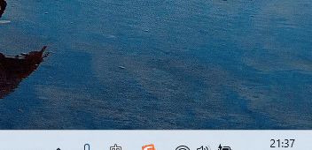

<div align="center">

# 🔔 Claude Code Notify

**Native Windows Toast notifications for Claude Code**

**[📖 中文文档](README_CN.md)**




*Click the notification to jump back to your Claude Code window*

</div>

---

## ✨ Features

- 🔔 **Native Windows Toast** — Clean, system-integrated notifications
- 🎯 **One-Click Return** — Click to jump back to your terminal/editor
- 🖥️ **Wide Compatibility** — VSCode, Cursor, JetBrains, Windows Terminal, and more
- 🔄 **Tab-Aware** — Supports Windows Terminal tab switching
- 🎨 **Auto Icon** — Extracts the calling application's icon

---

## 🚀 Installation

```bash
claude plugin marketplace add swdrts/claude-code-notify
claude plugin install claude-code-notify@claude-code-notify
```

That's it. Restart Claude Code and notifications will work automatically.

### WSL Permission Fix

If you install the plugin inside WSL and hooks fail with `Permission denied`, make the bundled Windows executable runnable:

```bash
chmod +x ~/.claude/plugins/cache/claude-code-notify/claude-code-notify/*/notifications/ToastWindow.exe
```

This is the workaround from [issue #2](https://github.com/chuilishi/claude-code-notify/issues/2). If your cache path uses a fixed version directory, `*` can be replaced with that version, for example `1.1.0`.

---

## 📖 Usage

After Claude finishes responding, a notification appears:

| Action | Result |
|--------|--------|
| **Left-click** | Jump back to Claude Code window |
| **Right-click** / **X** | Dismiss notification |

---

## 🗑️ Uninstall

```bash
claude plugin uninstall claude-code-notify
```

---

<details>
<summary><b>⚙️ How It Works</b></summary>

<br>

### Plugin System

This project uses Claude Code's **plugin system** to register hooks automatically — no manual `settings.json` editing required. Hooks are defined in `hooks/hooks.json` and discovered by Claude Code at startup.

### Hook Flow

| Hook | Trigger | Action |
|------|---------|--------|
| `UserPromptSubmit` | You send a message | Saves current window handle, active tab, and caller app icon |
| `Stop` | Claude finishes | Shows "Task completed" notification (orange border) |
| `Notification` | Claude needs input (permission / idle / MCP elicitation) | Shows context-aware notification (yellow border) with title like "Permission Required", "Claude is Waiting", "MCP Asks" |
| `PreToolUse` (`AskUserQuestion` \| `ExitPlanMode`) | Claude asks a question or finishes a plan | Shows "Claude is Asking" / "Plan Ready for Approval" notification |
| `SessionEnd` | Session ends | Cleans up the session's state file |
| *Click notification* | — | Activates saved window and switches to the correct tab |

### Session Isolation

Each Claude Code session has a unique `session_id` (received via stdin JSON). State is stored per-session in `%TEMP%\claude-notify-{session_id}.txt`, so multiple Claude instances don't interfere with each other.

### Windows Terminal Tab Switching

When running inside Windows Terminal, simply bringing the window to the foreground isn't enough — the user may have switched to a different tab. This project uses the **Windows UI Automation API** to:

1. Detect if the foreground window is Windows Terminal (by checking for the `CASCADIA_HOSTING_WINDOW_CLASS` window class)
2. Enumerate all tab items and record the **RuntimeId** of the currently selected tab at prompt time
3. On notification click, find the tab with the matching RuntimeId and call `IUIAutomationSelectionItemPattern::Select()` to switch back to it

### Caller App Icon Extraction

The notification displays the icon of the app you're using (VSCode, Cursor, JetBrains IDEs, etc.), not a generic icon. This is done by **walking up the process tree** at prompt time:

- Skips known shell/runtime processes (cmd, powershell, bash, node, python, uv, etc.)
- Recognizes known apps: **VSCode**, **Cursor**, **Windsurf**, **Codium**, **JetBrains IDEs** (IntelliJ, WebStorm, PyCharm, Rider, GoLand, CLion), **Windows Terminal**, **ConEmu**, **Tabby**, **WezTerm**
- Extracts the app's icon via `ExtractIconExW()` and displays it in the toast

### Window Activation

Windows restricts `SetForegroundWindow()` — a background process can't just steal focus. This project uses several techniques to work around it:

- `AllowSetForegroundWindow(ASFW_ANY)` to permit foreground changes
- ALT key simulation trick to satisfy Windows' focus-stealing prevention
- Thread input attachment (`AttachThreadInput`) between current, foreground, and target threads
- Combined `SetWindowPos` + `BringWindowToTop` + `SwitchToThisWindow` + `SetForegroundWindow` for reliable activation

### Toast Stacking

Multiple notifications stack vertically (Telegram-style) without overlapping:

- All toasts share the class name `ClaudeCodeToast` and discover each other via `EnumWindows`
- New toasts appear above existing ones; when one closes, others slide down smoothly
- Only the bottom toast starts the auto-dismiss timer; upper toasts wait
- Mouse hover over **any** toast pauses the timer for **all** toasts

### Non-Intrusive Display

Toasts are created with `WS_EX_NOACTIVATE | WS_EX_TOPMOST | WS_EX_LAYERED`, so they:

- Never steal focus from your current window
- Stay on top of all windows
- Support smooth fade-out animation via alpha blending

</details>

---

<div align="center">

MIT License

</div>
